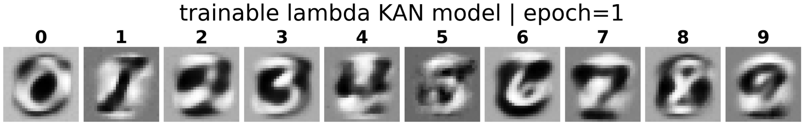
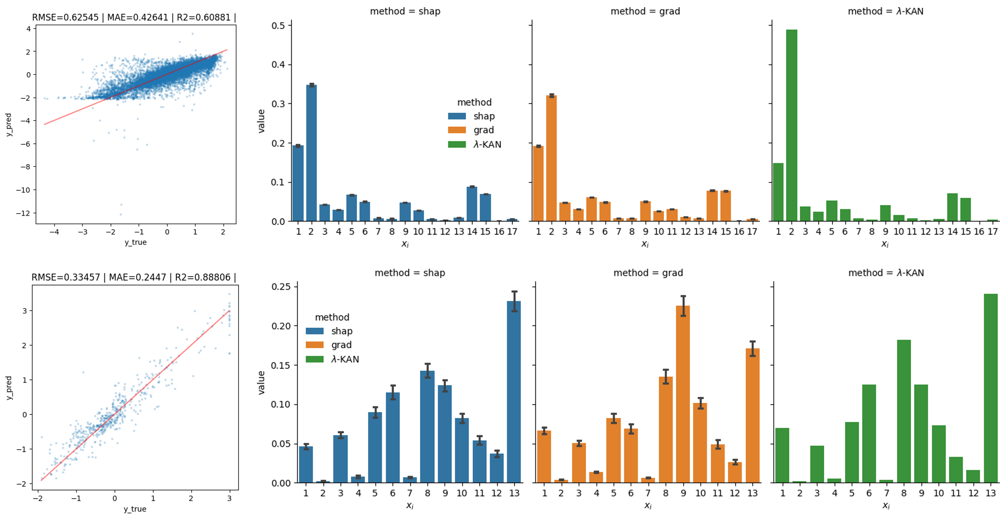

# $\lambda$-KAN as architecture-based EXAI.

*MNIST. Linear classifier and trainable $\lambda$-KAN sensitivity-maps evolution during training*

# General Description
This project presents the software code for applying $\lambda$ - Kolmogorov-Arnold networks ($\lambda$-KAN).

$\lambda$-KAN is modification of KAN, based on Kahane`s version of Kolmogorov-Arnold theorem:

$$f(x_{1},\cdot\cdot\cdot, x_{n})=\sum_{q=1}^{2n+1}\Phi_{q}(\sum_{p=1}^{n}\lambda_{p}\cdot\varphi_{q}(x_{p}))$$

This modification of KAN allows treat $\lambda_{p}$ coefficients as measure of sensitivity model to $x_{p}$ inputs.

$\lambda$-KAN was tested on 4 synthetic, 2 real-world datasets and MNIST with using SHAP and LIME as reference interpretation methods.

*SHAP, LIME and $\lambda$ sensitivity analyses of $\lambda$-KAN on Curated solubility (high row) and Boston housing(low row) datasets*

---
In order to improve approximation abilities while maintaining interpretative capabilities of $\lambda$-KAN, trainable $\lambda$-KAN was introduced:

$$f(x_{1},\cdot\cdot\cdot, x_{n})=\sum_{q=1}^{2n+1}\Phi_{q}(\sum_{p=1}^{n}\lambda_{p}(1+\alpha g(\bold{x}))\cdot\varphi_{q}(x_{p}))$$

Trainable $\lambda$-KAN have shown best interpretation-accuracy trade on MNIST.

|  | Lin. class. | $\lambda$-KAN | Trainable $\lambda$-KAN | MLP |
|--|-------------|---------------|-------------------------|-----|
| Acc. on test | 92.5% | 89.2% | 95.9% | 97.9% |

Code was partially based on pykan framework (https://github.com/KindXiaoming/pykan?ysclid=mbpkse6kxx388413783)

---
# Code files
Directory hierarchy: 

1) Supportive code:
    * source.py - 
        1. Visualising functions and KAN results analysing; 
        2. $\lambda$-KAN realisation;
        3. Interpretability analyse of lambda-KAN.

2) _Benchmarks_/: Providing training and interpretability-analysis on $\lambda$-KAN using test functions and real-world benchmarks.
    * lmd_kan_f1.ipynb
    * lmd_kan_f1_extend_input.ipynb - _extended_input_ stands for adding two random inputs

        ...
    * lmd_kan_f4.ipynb
    * lmd_kan_f4_extend_input.ipynb
    * lmd_kan_boston_housing.ipynb - Boston housing benchmark is used
    * lmd_kan_curated_solubility.ipynb - Curated solubility benchmark is used

3) _MNIST_example_/: Applying MLP, Linear classificator, $\lambda$-KAN and trainable $\lambda$-KAN to MNIST. Investigating interpretability of the last three models.

    Gifs of sensitivity-maps evolution during training process can be found in _MNIST_example/logs/.../sens_pic_

---